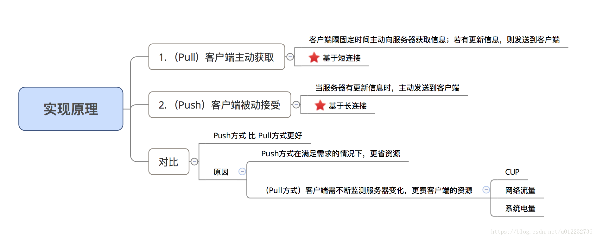
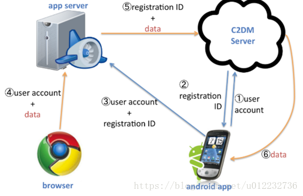
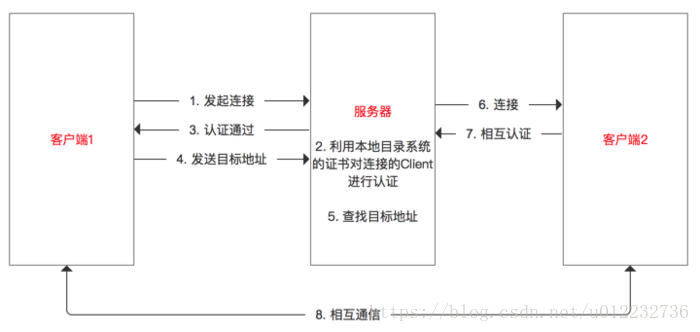

https://blog.csdn.net/qq_36204764/article/details/106217269

### 1.消息推送的实质

  实际上，是当服务器有新消息需推送给用户时，先发送给应用App，应用App再发送给用户

### 3.作用

产品角度：功能需要，如：资讯类产品的新闻推送、工具类产品的公告推送等等
运营角度：活动运营需要，如：电商类产品的促销活动；召回用户 / 提高活跃度等等
作为开发者，不要有需求就接，应该多思考、多理解用户 / 功能的使用场景，有助于我们更好地去选择合适的开发方式

### 3.原理

### 4.七种主流的消息推送方式

**1.C2DM**

Cloud to Device Messaging，云端推送，是Android系统级别的消息推送服务（**Google**出品）

C2DM服务负责处理诸如消息排队等事务，并向运行于目标设备上的应用程序分发这些消息。

优点：
C2DM提供了一个简单的、轻量级的机制，允许服务器可以通知移动应用程序直接与服务器进行通信，以便于从服务器获取应用程序更新和用户数据。
缺点：
依赖于Google官方提供的C2DM服务器，但在国内使用Google服务需要翻墙，成本较大；
需要用户手机安装Google服务。但由于Android机型、系统的碎片化 & 国内环境，国内的Android系统都自动去除Google服务，假如要使用C2DM服务，这意味着用户还得去安装Google服务，成本较大。

**2.轮询**

基于Pull方式，应用程序隔固定时间主动与服务器进行连接并查询是否有新的消息
优点：
实时性好
缺点：
成本大，需要自己实现与服务器之间的通信，例如消息排队等；

到达率不确定，考虑轮询的频率：太低可能导致消息的延迟；太高，更费客户端的资源（CPU资源、网络流量、系统电量）和服务器资源（网络带宽）

**3.SMS信令推送**

基于Push方式，服务器有新消息时，发送1条类似短信的信令给客户端，客户端通过拦截信令，解析消息内容 / 向服务器获取信息
优点 ：可实现完全的实时操作

缺点 ：：成本高（主要是短信资费的支出）

**4.MQTT协议**

轻量级的消息发布/订阅协议，基于Push方式，wmqtt.jar 是IBM提供的MQTT协议的实现

**5.XMPP协议**

定义
Extensible Messageing and Presence Protocol，可扩展消息与存在协议，是基于可扩展标记语言（XML）的协议，是目前主流的四种IM协议之一
其他三种：
即时信息和空间协议（IMPP）
空间和即时信息协议（PRIM）
即时通讯和空间平衡扩充的进程开始协议SIP（SIMPLE）

原理: XMPP中定义了三个角色，分别是客户端、服务器和网关

客户端
通过 TCP/IP与XMPP 服务器连接，然后在之上传输与即时通讯相关的指令（XML）；
解析组织好的 XML 信息包；
理解消息数据类型。
XMPP的核心：XML流传输协议（在网络上分片断发送XML的流协议），也是即时通讯指令的传递基础，即XMPP用TCP传的是XML流
与即时通讯相关的指令，在以前要么用2进制的形式发送（比如QQ），要么用纯文本指令加空格加参数加换行符的方式发送（比如MSN）。
XMPP传输的即时通讯指令的逻辑与以往相仿，只是协议的形式变成了XML格式的纯文本。
服务器

监听客户端连接，并直接与客户端应用程序通信（客户端信息记录）
与其他 XMPP 服务器通信；
网关：与异构即时通信系统进行通信
异构系统包括SMS（短信），MSN，ICQ等
通信能够在这三者的任意两个之间双向发生。

原理流程

优点
开源：可通过修改其源代码来适应我们的应用程序。
简单：XML易于解析和阅读；将复杂性从客户端转移到了服务器端
可拓展性强：继承了在XML环境中灵活的发展性，可进一步对协议进行扩展，实现更为完善的功能。
GTalk、QQ、IM等都用这个协议
缺点
如果将消息从服务器上推送出去，则不管消息是否成功到达客户端手机上，例：有一个很棒的基于XMPP协议的java开源Android push notification

**6. 使用第三方平台**

现今主流的推送平台分为
 手机厂商类：小米推送、华为推送。
 第三方平台类：友盟推送、极光推送(大部分公司都在使用，开源)、云巴（基于MQTT）
 BAT大厂的平台推送：阿里云移动推送、腾讯信鸽推送、百度云推送

**7. 自己搭建**

如果你的产品对于消息推送具备较高的功能和性能要求，同时对安全性要求非常高的话，自己搭建可能是最好的方式，但这种方式无疑成本是最高的。

**总结**

客户端UUID+应用包ID，推送证书等等，可以确认要推送的地址，客户端在注册后，服务端（自开发或第三方或官方平台）在接收到推送的消息后，向注册终端播送

