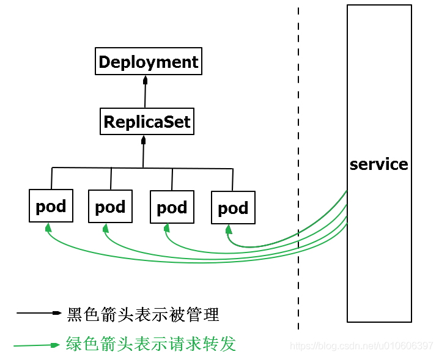

## Kubernetes资源对象Pod、ReplicaSet、Deployment、Service之间的关系



**Pod：**

Pod是一个或多个容器的组合，这些容器共享存储、网络和命名空间，以及如何运行的规范。Pod是Kubernetes的最小可部署单元。Pod的中文译词是豌豆荚，docker容器就像是豆子运行在豌豆荚内。

**ReplicaSet：**
先说下Replication Controller。Replication Controller的作用是确保Pod以指定的副本个数运行。
ReplicaSet是Replication Controller升级版。ReplicaSet和Replication Controller之间的唯一区别是对选择器支持。Replication Controller只支持基于等式的selector（env=dev或environment!=qa），但ReplicaSet还支持新的，基于集合的selector（version in (v1.0,v2.0)或env notin (dev, qa)）。
在yaml文件中通过spec.replicas声明pod的副本数。

**Deployment：**
Deployment用于管理Pod、ReplicaSet，可实现滚动升级和回滚应用、扩容和缩容。

**Service：**
试想一个问题，ReplicaSet定义了pod的数量是2，当一个pod由于某种原因停止了，ReplicaSet会新建一个pod，以确保运行中的pod数量始终是2。但每个pod都有自己的ip，前端请求不知道这个新pod的ip是什么，那前端的请求如何发送到新pod中呢？
答案是使用Service
k8s的Service定义了一个服务的访问入口地址，前端的应用通过这个入口地址访问其背后的一组由Pod副本组成的集群实例，来自外部的访问请求被负载均衡到后端的各个容器应用上。Service与其后端Pod副本集群之间则是通过Label Selector实现关联。
请说人话：前端请求不是直接发送给Pod，而是发送到Service，Service再将请求转发给pod。

总结一下：Pod被ReplicaSet管理，ReplicaSet控制pod的数量；ReplicaSet被Deployment管理，Deployment控制pod应用的升级、回滚，当然也能控制pod的数量。Service提供一个统一固定入口，负责将前端请求转发给Pod


## 静态 Pod 

*静态 Pod（Static Pod）* 直接由特定节点上的 `kubelet` 守护进程管理， 不需要[API 服务器](https://kubernetes.io/zh/docs/reference/command-line-tools-reference/kube-apiserver/)看到它们。 尽管大多数 Pod 都是通过控制面（例如，[Deployment](https://kubernetes.io/zh/docs/concepts/workloads/controllers/deployment/)） 来管理的，对于静态 Pod 而言，`kubelet` 直接监控每个 Pod，并在其失效时重启之。

静态 Pod 通常绑定到某个节点上的 [kubelet](https://kubernetes.io/docs/reference/generated/kubelet)。 其主要用途是运行自托管的控制面。 在自托管场景中，使用 `kubelet` 来管理各个独立的 [控制面组件](https://kubernetes.io/zh/docs/concepts/overview/components/#control-plane-components)。

`kubelet` 自动尝试为每个静态 Pod 在 Kubernetes API 服务器上创建一个 [镜像 Pod](https://kubernetes.io/zh/docs/reference/glossary/?all=true#term-mirror-pod)。 这意味着在节点上运行的 Pod 在 API 服务器上是可见的，但不可以通过 API 服务器来控制。


## k8s存储

Container 中的文件在磁盘上是临时存放的，这给 Container 中运行的较重要的应用 程序带来一些问题。问题之一是当容器崩溃时文件丢失。kubelet 会重新启动容器， 但容器会以干净的状态重启。 第二个问题会在同一 `Pod` 中运行多个容器并共享文件时出现。 Kubernetes [卷（Volume）](https://kubernetes.io/zh/docs/concepts/storage/volumes/) 这一抽象概念能够解决这两个问题。卷有很多类型，有临时卷和持久卷

### 临时卷的类型

Kubernetes 为了不同的目的，支持几种不同类型的临时卷：

- [emptyDir](https://kubernetes.io/zh/docs/concepts/storage/volumes/#emptydir)： Pod 启动时为空，存储空间来自本地的 kubelet 根目录（通常是根磁盘）或内存
- [configMap](https://kubernetes.io/zh/docs/concepts/storage/volumes/#configmap)、 [downwardAPI](https://kubernetes.io/zh/docs/concepts/storage/volumes/#downwardapi)、 [secret](https://kubernetes.io/zh/docs/concepts/storage/volumes/#secret)： 将不同类型的 Kubernetes 数据注入到 Pod 中
- [CSI 临时卷](https://kubernetes.io/zh/docs/concepts/storage/volumes/#csi-ephemeral-volumes)： 类似于前面的卷类型，但由专门[支持此特性](https://kubernetes-csi.github.io/docs/drivers.html) 的指定 [CSI 驱动程序](https://github.com/container-storage-interface/spec/blob/master/spec.md)提供
- [通用临时卷](https://kubernetes.io/zh/docs/concepts/storage/ephemeral-volumes/#generic-ephemeral-volumes)： 它可以由所有支持持久卷的存储驱动程序提供

`emptyDir`、`configMap`、`downwardAPI`、`secret` 是作为 [本地临时存储](https://kubernetes.io/zh/docs/concepts/configuration/manage-resources-containers/#local-ephemeral-storage) 提供的。它们由各个节点上的 kubelet 管理。

CSI 临时卷 *必须* 由第三方 CSI 存储驱动程序提供。

通用临时卷 *可以* 由第三方 CSI 存储驱动程序提供，也可以由支持动态配置的任何其他存储驱动程序提供。 一些专门为 CSI 临时卷编写的 CSI 驱动程序，不支持动态供应：因此这些驱动程序不能用于通用临时卷。

使用第三方驱动程序的优势在于，它们可以提供 Kubernetes 本身不支持的功能， 例如，与 kubelet 管理的磁盘具有不同运行特征的存储，或者用来注入不同的数据

### 持久卷（PersistentVolume，PV）

是集群中的一块存储，可以由管理员事先供应，或者 使用[存储类（Storage Class）](https://kubernetes.io/zh/docs/concepts/storage/storage-classes/)来动态供应。 持久卷是集群资源，就像节点也是集群资源一样。PV 持久卷和普通的 Volume 一样，也是使用 卷插件来实现的，只是它们拥有独立于任何使用 PV 的 Pod 的生命周期。 此 API 对象中记述了存储的实现细节，无论其背后是 NFS、iSCSI 还是特定于云平台的存储系统。

持久卷申领（PersistentVolumeClaim，PVC）表达的是用户对存储的请求。概念上与 Pod 类似。 Pod 会耗用节点资源，而 PVC 申领会耗用 PV 资源。Pod 可以请求特定数量的资源（CPU 和内存）；同样 PVC 申领也可以请求特定的大小和访问模式 （例如，可以要求 PV 卷能够以 ReadWriteOnce、ReadOnlyMany 或 ReadWriteMany 模式之一来挂载，参见[访问模式](https://kubernetes.io/zh/docs/concepts/storage/persistent-volumes/#access-modes)）。

如果 PVC 申领指定存储类为 `""`，则相当于为自身禁止使用动态供应的卷

### configMap

[`configMap`](https://kubernetes.io/zh/docs/tasks/configure-pod-container/configure-pod-configmap/) 卷 提供了向 Pod 注入配置数据的方法。 ConfigMap 对象中存储的数据可以被 `configMap` 类型的卷引用，然后被 Pod 中运行的 容器化应用使用。

引用 configMap 对象时，你可以在 volume 中通过它的名称来引用。 你可以自定义 ConfigMap 中特定条目所要使用的路径。

### emptyDir

当 Pod 分派到某个 Node 上时，`emptyDir` 卷会被创建，并且在 Pod 在该节点上运行期间，卷一直存在。 就像其名称表示的那样，卷最初是空的。 尽管 Pod 中的容器挂载 `emptyDir` 卷的路径可能相同也可能不同，这些容器都可以读写 `emptyDir` 卷中相同的文件。 当 Pod 因为某些原因被从节点上删除时，`emptyDir` 卷中的数据也会被永久删除。

> **说明：** 容器崩溃并**不**会导致 Pod 被从节点上移除，因此容器崩溃期间 `emptyDir` 卷中的数据是安全的。

`emptyDir` 的一些用途：

- 缓存空间，例如基于磁盘的归并排序。
- 为耗时较长的计算任务提供检查点，以便任务能方便地从崩溃前状态恢复执行。
- 在 Web 服务器容器服务数据时，保存内容管理器容器获取的文件。

### hostPath

`hostPath` 卷能将**主机节点文件系统**上的文件或目录挂载到你的 Pod 中。 虽然这不是大多数 Pod 需要的，但是它为一些应用程序提供了强大的逃生舱。

例如，`hostPath` 的一些用法有：

- 运行一个需要访问 Docker 内部机制的容器；可使用 `hostPath` 挂载 `/var/lib/docker` 路径。
- 在容器中运行 cAdvisor 时，以 `hostPath` 方式挂载 `/sys`。
- 允许 Pod 指定给定的 `hostPath` 在运行 Pod 之前是否应该存在，是否应该创建以及应该以什么方式存在。

除了必需的 `path` 属性之外，用户可以选择性地为 `hostPath` 卷指定 `type`。

```yaml
apiVersion: v1
kind: Pod
metadata:
  name: test-pd
spec:
  containers:
  - image: k8s.gcr.io/test-webserver
    name: test-container
    volumeMounts:
    - mountPath: /test-pd
      name: test-volume
  volumes:
  - name: test-volume
    hostPath:
      # 宿主上目录位置
      path: /data
      # 此字段为可选
      type: Directory
```

### local

`local` 卷所代表的是某个被挂载的本地存储设备，例如磁盘、分区或者目录。

`local` 卷只能用作静态创建的持久卷。尚不支持动态配置。

与 `hostPath` 卷相比，`local` 卷能够以持久和可移植的方式使用，而无需手动将 Pod 调度到节点。系统通过查看 PersistentVolume 的节点亲和性配置，就能了解卷的节点约束。

然而，`local` 卷仍然取决于底层节点的可用性，并不适合所有应用程序。 如果节点变得不健康，那么`local` 卷也将变得不可被 Pod 访问。使用它的 Pod 将不能运行。 使用 `local` 卷的应用程序必须能够容忍这种可用性的降低，以及因底层磁盘的耐用性特征 而带来的潜在的数据丢失风险。

下面是一个使用 `local` 卷和 `nodeAffinity` 的持久卷示例：

```yaml
apiVersion: v1
kind: PersistentVolume
metadata:
  name: example-pv
spec:
  capacity:
    storage: 100Gi
  volumeMode: Filesystem
  accessModes:
  - ReadWriteOnce
  persistentVolumeReclaimPolicy: Delete
  storageClassName: local-storage
  local:
    path: /mnt/disks/ssd1
  nodeAffinity:
    required:
      nodeSelectorTerms:
      - matchExpressions:
        - key: kubernetes.io/hostname
          operator: In
          values:
          - example-node
```

使用 `local` 卷时，你需要设置 PersistentVolume 对象的 `nodeAffinity` 字段。 Kubernetes 调度器使用 PersistentVolume 的 `nodeAffinity` 信息来将使用 `local` 卷的 Pod 调度到正确的节点。

PersistentVolume 对象的 `volumeMode` 字段可被设置为 "Block" （而不是默认值 "Filesystem"），以将 `local` 卷作为原始块设备暴露出来。

使用 `local` 卷时，建议创建一个 StorageClass 并将其 `volumeBindingMode` 设置为 `WaitForFirstConsumer`。要了解更多详细信息，请参考 [local StorageClass 示例](https://kubernetes.io/zh/docs/concepts/storage/storage-classes/#local)。 延迟卷绑定的操作可以确保 Kubernetes 在为 PersistentVolumeClaim 作出绑定决策时， 会评估 Pod 可能具有的其他节点约束，例如：如节点资源需求、节点选择器、Pod 亲和性和 Pod 反亲和性。

你可以在 Kubernetes 之外单独运行静态驱动以改进对 local 卷的生命周期管理。 请注意，此驱动尚不支持动态配置。 有关如何运行外部 `local` 卷驱动，请参考 [local 卷驱动用户指南](https://github.com/kubernetes-sigs/sig-storage-local-static-provisioner)。

> **说明：** 如果不使用外部静态驱动来管理卷的生命周期，用户需要手动清理和删除 local 类型的持久卷。

### nfs

`nfs` 卷能将 NFS (网络文件系统) 挂载到你的 Pod 中。 不像 `emptyDir` 那样会在删除 Pod 的同时也会被删除，`nfs` 卷的内容在删除 Pod 时会被保存，卷只是被卸载。 这意味着 `nfs` 卷可以被预先填充数据，并且这些数据可以在 Pod 之间共享。


```yaml
kind: StorageClass
apiVersion: storage.k8s.io/v1
metadata:
  name: local-storage
provisioner: kubernetes.io/no-provisioner
volumeBindingMode: WaitForFirstConsumer
```

本地卷还不支持动态制备，然而还是需要创建 StorageClass 以延迟卷绑定， 直到完成 Pod 的调度。这是由 `WaitForFirstConsumer` 卷绑定模式指定的。

延迟卷绑定使得调度器在为 PersistentVolumeClaim 选择一个合适的 PersistentVolume 时能考虑到所有 Pod 的调度限制。

## IP和Port

Kubernetes集群里有三种IP地址，分别如下：

- Node IP：Node节点的IP地址，即物理网卡的IP地址。
- Pod IP：Pod的IP地址，即docker容器的IP地址，此为虚拟IP地址。
- Cluster IP：Service的IP地址，此为虚拟IP地址。

**Node IP**

可以是物理机的IP（也可能是虚拟机IP）。每个Service都会在Node节点上开通一个端口，外部可以通过NodeIP:NodePort即可访问Service里的Pod,和我们访问服务器部署的项目一样，IP:端口/项目名

**Pod IP**

Pod IP是每个Pod的IP地址，他是Docker Engine根据docker网桥的IP地址段进行分配的，通常是一个虚拟的二层网络

同Service下的pod可以直接根据PodIP相互通信
不同Service下的pod在集群间pod通信要借助于 cluster ip
pod和集群外通信，要借助于node ip

**Cluster IP**

Service的IP地址，此为虚拟IP地址。外部网络无法ping通，只有kubernetes集群内部访问使用。

Cluster IP是一个虚拟的IP，但更像是一个伪造的IP网络，原因有以下几点

1. Cluster IP仅仅作用于Kubernetes Service这个对象，并由Kubernetes管理和分配P地址
2. Cluster IP无法被ping，他没有一个“实体网络对象”来响应
3. Cluster IP只能结合Service Port组成一个具体的通信端口，单独的Cluster IP不具备通信的基础，并且他们属于Kubernetes集群这样一个封闭的空间。
4. 在不同Service下的pod节点在集群间相互访问可以通过Cluster IP

**三种IP网络间的通信**

service地址和pod地址在不同网段，service地址为虚拟地址，不配在pod上或主机上，外部访问时，先到Node节点网络，再转到service网络，最后代理给pod网络。

## Pod和容器

**一：在探讨pod和容器的区别之前，我们先谈谈为什么k8s会使用pod这个最小单元，而不是使用docker的容器，k8s既然使用了pod，当然有它的理由。**

------

1：更利于扩展
k8s不仅仅支持Docker容器，也支持rkt甚至用户自定义容器，为什么会有这么多不同的容器呢，因为容器并不是真正的虚拟机，参考我之前的博客，docker的一些概念和误区总结，此外，Kubernetes不依赖于底层某一种具体的规则去实现容器技术，而是通过CRI这个抽象层操作容器，这样就会需要pod这样一个东西，pod内部再管理多个业务上紧密相关的用户业务容器，就会更有利用业务扩展pod而不是扩展容器。

------

2：更容易定义一组容器的状态

如果我们没有使用pod，而是直接使用一组容器去跑一个业务呢，那么当其中一个或者若干个容器出现问题呢，我们如何去定义这一组容器的状态呢，通过pod这个概念，这个问题就可以很好的解决，一组业务容器跑在一个k8s的pod中，这个pod中会有一个pause容器，这个容器与其他的业务容器都没有关系，以这个pause容器的状态来代表这个pod的状态，

------

3：利于容器间文件共享，以及通信。
pause容器有一个ip地址，和一个存储卷，pod中的其他容器共享pause容器的ip地址和存储，这样就做到了文件共享和互信。
**二：pod和容器的区别**
总结，pod是k8s的最小单元，容器包含在pod中，一个pod中有一个pause容器和若干个业务容器，而容器就是单独的一个容器，简而言之，pod是一组容器，而容器单指一个容器。

## Deployment 和 Pod

Pod封装了一个或多个应用程序的容器(比如nginx等),存储资源,唯一的网络IP以及管理容器的一些选项
Pod标示的是一个部署单元,可以理解为Kubernetes中的应用程序的单个实例,它可能由单个容器组成,也可能由少量紧密耦合并共享资源的容器组成。

> 如果多个容器在同一Pod下他们公用一个IP所以不能出现重复的端口号,一个Pod下的多个容器可以使用localhost来访问对方端口
>
> 因为Pod是最小的单元，如果在Pod中容器出现异常，Pod终止了是不会重启，在实际使用场景下基本不会直接使用Pod而是使用Deployment部署自己的应用

在早期版本使用Replication Controller对Pod副本数量进行管理，在新的版本中官方推荐使用Deployment来代替RC，Deployment相对RC有这些好处

- Deployment拥有更加灵活强大的升级、回滚功能，并且支持滚动更新
- 使用Deployment升级Pod只需要定义Pod的最终状态，k8s会为你执行必要的操作(RC要自己定义如何操作)
  不管是RC还是Deployment解决的主要问题是，每个Pod都运行给定应用程序的单个实例。如果您想水平扩展应用程序（例如，运行多个同样的实例），则应该使用多个Pod，如何管理Pod就是他们的核心

总的来说deployment根据Pod的标签关联到Pod，为了管理pod的生命周期

**Pod被ReplicaSet管理，ReplicaSet控制pod的数量；ReplicaSet被Deployment管理，Deployment控制pod应用的升级、回滚，当然也能控制pod的数量。Service提供一个统一固定入口，负责将前端请求转发给Pod。**

## Pod 间访问

Pod间可以通过内部dns访问，ClusterIP在删除后重新部署会改变，不利于开发，Service的dn构成

`[service-name].[namespace-name].svc.[集群dn]`例如 `redis-master-sr.default.svc.cluster.local`

Kubernetes Service 从逻辑上（网络角度）代表了一组 Pod，具体是哪些 Pod 则是由 label 来挑选。Service 有自己 IP，而且这个 IP 是不变的。客户端只需要访问 Service 的 IP，Kubernetes 则负责建立和维护 Service 与 Pod 的映射关系。无论后端 Pod 如何变化，对客户端不会有任何影响，因为 Service 没有变。

Pod间的容器是共享同一网络的，deployment下的多个容器属于同一Pod，一般一组Pod对应一个Service和一个Deployment

