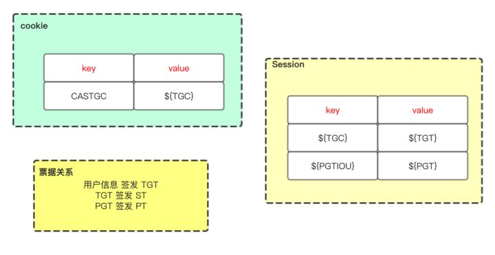

## CAS

**SSO 仅仅是一种架构，一种设计，而 CAS 则是实现 SSO 的一种手段。两者是抽象与具体的关系。当然，除了 CAS 之外，实现 SSO 还有其他手段，比如简单的 cookie。**

CAS （Central Authentication Service）中心授权服务，本身是一个开源协议，分为 1.0 版本和 2.0 版本。1.0 称为基础模式，2.0称为代理模式，适用于存在非 Web 应用之间的单点登录。本文只涉及 CAS 1.0，下文中将详细介绍。

 

SSO 的演进与分类

**下面详述一下各种场景下的 SSO，它们之间是逐步升级，逐步复杂化的关系。**

1.同域 SSO

**如图，同域 SSO 是最简单的一种情况。**

此时，两个产品都是在一个域名下，单点登录是很自然的选择。我们来捋一捋步骤，搞清楚这里的步骤是理解后文的基础，千万不要跳过。

1. 用户访问产品 a，向 后台服务器发送登录请求。
2. 登录认证成功，服务器把用户的登录信息写入 session。
3. 服务器为该用户生成一个 cookie，并加入到 response header 中，随着请求返回而写入浏览器。该 cookie 的域设定为 [http://dxy.cn](https://link.zhihu.com/?target=http%3A//dxy.cn)。
4. 下一次，当用户访问同域名的产品 b 时，由于 a 和 b 在同一域名下，也是 [http://dxy.cn](https://link.zhihu.com/?target=http%3A//dxy.cn)，浏览器会自动带上之前的 cookie。此时后台服务器就可以通过该 cookie 来验证登录状态了。

实际上，这种场景就是最简单最传统的登录操作。虽然我们把产品 a 和 b 人为分开了，但由于它们在同域上，就算看成是同一产品的不同类目也未尝不可。我们没有设置独立的 SSO 服务器，因为业务后台服务器本身就足以承担 SSO 的职能。

2.同父域 SSO

**同父域 SSO 是同域 SSO 的简单升级，唯一的不同在于，服务器在返回 cookie 的时候，要把cookie 的 domain 设置为其父域。**

比如两个产品的地址分别为 [http://a.dxy.cn](https://link.zhihu.com/?target=http%3A//a.dxy.cn) 和 [http://b.dxy.cn](https://link.zhihu.com/?target=http%3A//b.dxy.cn)，那么 cookie 的域设置为 [http://dxy.cn](https://link.zhihu.com/?target=http%3A//dxy.cn) 即可。在访问 a 和 b 时，这个 cookie 都能发送到服务器，本质上和同域 SSO 没有区别。

3.跨域 SSO

**可以看到，在上面两种情况下，我们都没有专门设置 SSO 服务器。但是当两个产品不同域时，cookie 无法共享，所以我们必须设置独立的 SSO 服务器了。这个时候，我们就是通过标准的 CAS 方案来实现 SSO 的。下面我们就来详细介绍一下：**

### 详解CAS

CAS 1.0 协议定义了一组术语，一组票据，一组接口。

 

术语：

- Client：用户。
- Server：中心服务器，也是 SSO 中负责单点登录的服务器。
- Service：需要使用单点登录的各个服务，相当于上文中的产品 a/b。

接口：

- /login：登录接口，用于登录到中心服务器。
- /logout：登出接口，用于从中心服务器登出。
- /validate：用于验证用户是否登录中心服务器。
- /serviceValidate：用于让各个 service 验证用户是否登录中心服务器。

票据

- TGT：Ticket Grangting Ticket

TGT 是 CAS 为用户签发的登录票据，拥有了 TGT，用户就可以证明自己在 CAS 成功登录过。TGT 封装了 Cookie 值以及此 Cookie 值对应的用户信息。当 HTTP 请求到来时，CAS 以此 Cookie 值（TGC）为 key 查询缓存中有无 TGT ，如果有的话，则相信用户已登录过。

- TGC：Ticket Granting Cookie

CAS Server 生成TGT放入自己的 Session 中，而 TGC 就是这个 Session 的唯一标识（SessionId），以 Cookie 形式放到浏览器端，是 CAS Server 用来明确用户身份的凭证。

- ST：Service Ticket

ST 是 CAS 为用户签发的访问某一 service 的票据。用户访问 service 时，service 发现用户没有 ST，则要求用户去 CAS 获取 ST。用户向 CAS 发出获取 ST 的请求，CAS 发现用户有 TGT，则签发一个 ST，返回给用户。用户拿着 ST 去访问 service，service 拿 ST 去 CAS 验证，验证通过后，允许用户访问资源。

票据之间的关系如下图。注意，PGTIOU, PGT, PT 是 CAS 2.0 中的内容，感兴趣的同学可以自行了解。

#### 详细步骤

**看到这里，是不是又有点晕了？没关系，下面我们借助一个简单的场景，再来仔细捋一捋用 CAS 实现 SSO 的详细步骤，顺便加深理解之前提出的概念。**

开始！

1. 用户访问产品 a，域名是 [http://www.a.cn](https://link.zhihu.com/?target=http%3A//www.a.cn)。
2. 由于用户没有携带在 a 服务器上登录的 a cookie，所以 a 服务器返回 http 重定向，重定向的 url 是 SSO 服务器的地址，同时 url 的 query 中通过参数指明登录成功后，回跳到 a 页面。重定向的url 形如 [http://sso.dxy.cn/login?service=https%3A%2F%2Fwww.a.cn](https://link.zhihu.com/?target=http%3A//sso.dxy.cn/login%3Fservice%3Dhttps%3A%2F%2Fwww.a.cn)。
3. 由于用户没有携带在 SSO 服务器上登录的 TGC（看上面，票据之一），所以 SSO 服务器判断用户未登录，给用户显示统一登录界面。用户在 SSO 的页面上进行登录操作。
4. 登录成功后，SSO 服务器构建用户在 SSO 登录的 TGT（又一个票据），同时返回一个 http 重定向。这里注意：

- 重定向地址为之前写在 query 里的 a 页面。
- 重定向地址的 query 中包含 sso 服务器派发的 ST。
- 重定向的 http response 中包含写 cookie 的 header。这个 cookie 代表用户在 SSO 中的登录状态，它的值就是 TGC。
- 浏览器重定向到产品 a。此时重定向的 url 中携带着 SSO 服务器生成的 ST。
- 根据 ST，a 服务器向 SSO 服务器发送请求，SSO 服务器验证票据的有效性。验证成功后，a 服务器知道用户已经在 sso 登录了，于是 a 服务器构建用户登录 session，记为 a session。并将 cookie 写入浏览器。注意，此处的 cookie 和 session 保存的是用户在 a 服务器的登录状态，和 CAS 无关。
- 之后用户访问产品 b，域名是 [http://www.b.cn](https://link.zhihu.com/?target=http%3A//www.b.cn)。
- 由于用户没有携带在 b 服务器上登录的 b cookie，所以 b 服务器返回 http 重定向，重定向的 url 是 SSO 服务器的地址，去询问用户在 SSO 中的登录状态。
- 浏览器重定向到 SSO。注意，第 4 步中已经向浏览器写入了携带 TGC 的cookie，所以此时 SSO 服务器可以拿到，根据 TGC 去查找 TGT，如果找到，就判断用户已经在 sso 登录过了。
- SSO 服务器返回一个重定向，重定向携带 ST。注意，这里的 ST 和第4步中的 ST 是不一样的，事实上，每次生成的 ST 都是不一样的。
- 浏览器带 ST 重定向到 b 服务器，和第 5 步一样。
- b 服务器根据票据向 SSO 服务器发送请求，票据验证通过后，b 服务器知道用户已经在 sso 登录了，于是生成 b session，向浏览器写入 b cookie。

至此，整个登录流程结束。之后当用户访问 a 或者 b 后，直接会携带 a cookie/b cookie，就不用再向 SSO 确认了。

实际开发时，可以根据 CAS 增加更多的判断逻辑，比如，在收到CAS Server签发的ST后，如果 ST 被 hacker 窃取，并且 client 本身没来得及去验证 ST，被 hacker 抢先一步验证 ST，怎么解决。此时就可以在申请 ST 时添加额外验证因子（如ip、sessionId等）。