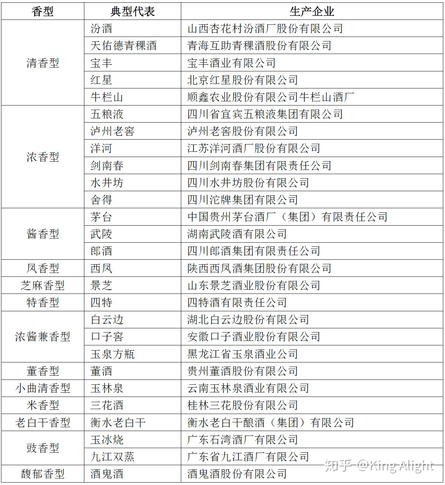
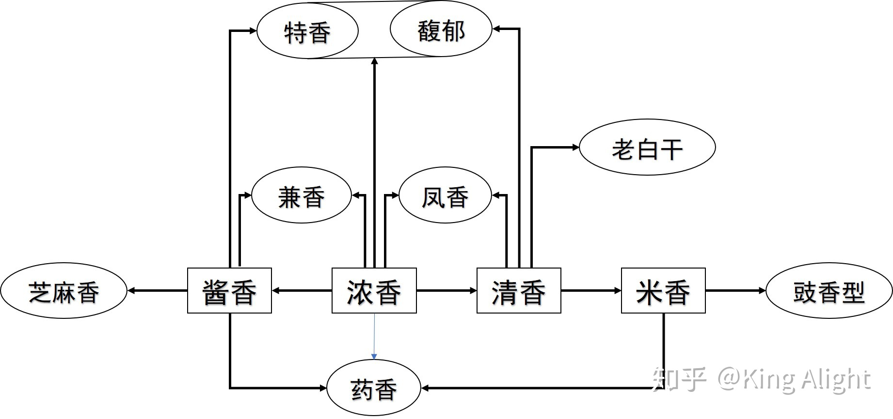

不同香型的香气主体：浓香：己酸乙酯、丁酸乙酯
清香：乙酸乙酯、乳酸乙酯
酱香：主体香气未能确认，酯类成分最复杂，各种酯都有，但总含量低于浓香。

酸在酒中，如果比例适当，会有清爽利口、醇滑绵甜；含量少，会寡淡、后味短；过量会酸味重、刺鼻。而酯类是香味物质中的种类最多、对香气影响最大的；乙酸乙酯、乳酸乙酯、己酸乙酯这三类起主导作用，其他酯类在呈香过程中起烘托作用。它们在酒内以不同的强度放香，形成白酒的复合香气，衬托住主体香韵，形成白酒的独特风格。

比如酱酒的酒醅（酿酒原料）只有高粱，酒曲原料也只有小麦；而浓香型酒，比如五粮液，酒醅原料有高粱、玉米、糯米、大米、小麦，所以五粮液又叫杂粮酒。酒曲里则有大麦、小麦、豌豆、黄豆等。原料不同，工艺也不同。比如发酵，酱酒用石窖，浓香用泥窖；下料、拌料、蒸馏也都不一样，这个可以改天开个新贴写。此外，由于产地不同，地理环境有差别，微生物、水、粮食形成的酿造体系皆不相同，这就带来了多变的风格。最简单的例子，同为酱酒，隔了一条河的郎酒和茅台就不一样；贵州茅系酱酒和湖南的武陵酱酒也不一样。同为浓香，川派和江淮派风格不一样，川派浓中带陈（也叫浓中带酱），苏派则为纯浓。

此外，由于勾兑技术的运用，不同香型的酒也不是独立存在的，也会包容并蓄、取长补短。比如浓香酒通常会加入1/100的酱酒来平衡香气，也会加入少量芝麻香的酒来改善余味。这就像大厨做菜，信手拈来，灵感不仅来自食材本身，也来自各种调味料的使用，以及不同食材的搭配。

**从北到南，从东到西，中国白酒香气由净到馥郁的程度越来越高，香气外放程度也渐渐增强，地理、人文对酒的酿造影响很大**

白酒香型关系，赖先生总结了一下：

